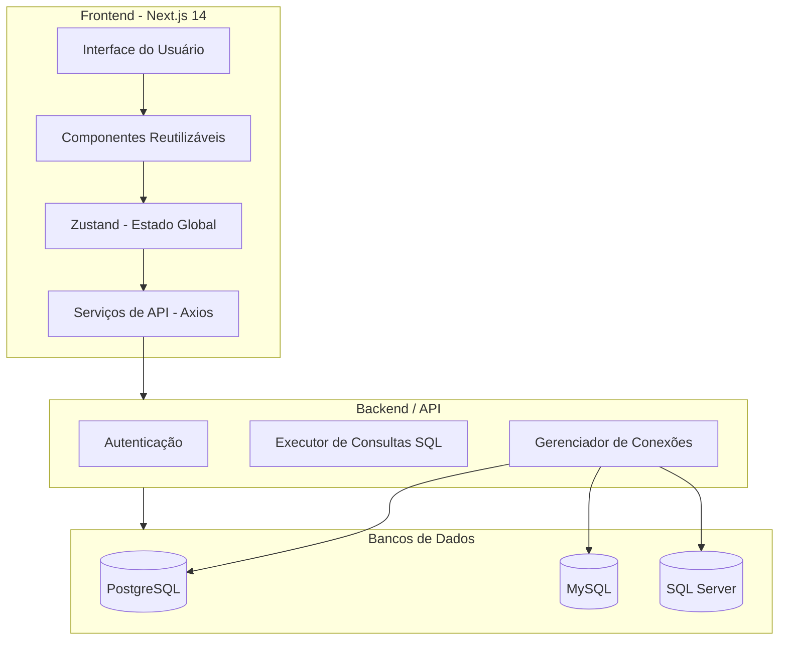

---

```markdown
# 📊 Gestor de Base de Dados - Frontend


O **Gestor de Base de Dados** é um sistema web moderno para **gerenciamento, consulta e visualização de bancos de dados** de forma intuitiva.  
Este repositório contém o **Frontend**, desenvolvido com **Next.js 14**, **TypeScript** e **Tailwind CSS**.

---

## 🧱 1. Estrutura Geral do Projeto (Arquitetura de Pastas)

# File Tree: gestorBd FrontEnd

**Generated:** 1/8/2026, 11:36:19 AM
**Root Path:** `c:\Users\IT\Documents\Python\gestorBd FrontEnd`

```

├── 📁 .github
│   └── 📁 workflows
│       └── ⚙️ azure-static-web-apps-nice-moss-04d1c2803.yml
├── 📁 app
│   ├── 📁 (landing)
│   │   ├── 📄 layout.tsx
│   │   └── 📄 page.tsx
│   ├── 📁 auth
│   │   ├── 📁 login
│   │   │   └── 📄 page.tsx
│   │   ├── 📁 register
│   │   │   ├── 📁 utils
│   │   │   │   └── 📄 index.ts
│   │   │   └── 📄 page.tsx
│   │   └── 📄 layout.tsx
│   ├── 📁 component
│   │   ├── 📁 ResultadosQueryComponent
│   │   │   ├── 📄 ExportButton.tsx
│   │   │   ├── 📄 HeaderControls.tsx
│   │   │   ├── 📄 QueryStatusIndicator .tsx
│   │   │   ├── 📄 ResultsHeader.tsx
│   │   │   ├── 📄 VirtualizedHeader.tsx
│   │   │   ├── 📄 VirtualizedRow.tsx
│   │   │   ├── 📄 funcs.tsx
│   │   │   └── 📄 types.ts
│   │   ├── 📁 columns-displayComponent
│   │   │   ├── 📄 FilterableGrid.tsx
│   │   │   └── 📄 RenderItem.tsx
│   │   ├── 📁 connectionComponent
│   │   │   └── 📄 ConnectionForm.tsx
│   │   ├── 📁 silederMenuComponent
│   │   │   ├── 📄 SidebarFooter.tsx
│   │   │   ├── 📄 SidebarHeader.tsx
│   │   │   ├── 📄 SidebarItem.tsx
│   │   │   └── 📄 sliderBar.tsx
│   │   ├── 📄 ConfirmDeleteModal.tsx
│   │   ├── 📄 ConnectionToggleButton.tsx
│   │   ├── 📄 ContextMenu_eliminar.tsx
│   │   ├── 📄 DatabaseList.tsx
│   │   ├── 📄 DynamicInputByType.tsx
│   │   ├── 📄 DynamicInputByTypeWithNullable.tsx
│   │   ├── 📄 EditFieldModal.tsx
│   │   ├── 📄 FeatureSection.tsx
│   │   ├── 📄 FiltroCondicaoItem.tsx
│   │   ├── 📄 ForeignKeySelect.tsx
│   │   ├── 📄 Header.tsx
│   │   ├── 📄 InInput.tsx
│   │   ├── 📄 InfoCard.tsx
│   │   ├── 📄 InteractiveResultTable.tsx
│   │   ├── 📄 JoinOptions.tsx
│   │   ├── 📄 LabeledSelect.tsx
│   │   ├── 📄 Loading_and_error-component.tsx
│   │   ├── 📄 MetadataModal.tsx
│   │   ├── 📄 ModalIntermediario.tsx
│   │   ├── 📄 NotificationComponent.tsx
│   │   ├── 📄 OrderByOptions.tsx
│   │   ├── 📄 QuickActions.tsx
│   │   ├── 📄 ScrollableTable.tsx
│   │   ├── 📄 Sidebar.tsx
│   │   ├── 📄 SidebarPopup.tsx
│   │   ├── 📄 StatsCards.tsx
│   │   ├── 📄 TableListSection.tsx
│   │   ├── 📄 UpcomingFeatures.tsx
│   │   ├── 📄 criar-registro.tsx
│   │   ├── 📄 date-input-component.tsx
│   │   ├── 📄 improved-labeled-select.tsx
│   │   ├── 📄 index.tsx
│   │   ├── 📄 pagination-component.tsx
│   │   ├── 📄 provader.tsx
│   │   ├── 📄 query-builder-component.tsx
│   │   ├── 📄 renderDistinctColumnSelector.tsx
│   │   └── 📄 table-columns-display.tsx
│   ├── 📁 createtamplete
│   │   ├── 📁 ReportTemplateBuilder
│   │   │   ├── 📁 SUBCOMPONENTS
│   │   │   │   └── 📄 index.tsx
│   │   │   ├── 📄 PropertyEditor.tsx
│   │   │   ├── 📄 ReportTemplateBuilder.tsx
│   │   │   ├── 📄 SectionPreview.tsx
│   │   │   ├── 📄 defaultSectionData.tsx
│   │   │   ├── 📄 generateDefaultTemplate.tsx
│   │   │   └── 📄 validateTemplate.tsx
│   │   ├── 📁 hooks
│   │   │   └── 📄 useSectionsManager.tsx
│   │   ├── 📁 types
│   │   │   └── 📄 index.ts
│   │   ├── 📁 ultils
│   │   │   └── 📄 index.ts
│   │   ├── 📄 layout.tsx
│   │   └── 📄 page.tsx
│   ├── 📁 home
│   │   ├── 📁 analizar
│   │   │   ├── 📄 TaskProject.tsx
│   │   │   └── 📄 page.tsx
│   │   ├── 📁 conexao
│   │   │   ├── 📄 notas.ts
│   │   │   └── 📄 page.tsx
│   │   ├── 📁 configuracao
│   │   │   └── 📄 page.tsx
│   │   ├── 📁 consultas
│   │   │   └── 📄 page.tsx
│   │   ├── 📁 historico
│   │   │   └── 📄 page.tsx
│   │   ├── 📁 hooks
│   │   │   └── 📄 useDBConnections.ts
│   │   ├── 📁 ocr
│   │   │   └── 📄 page.tsx
│   │   ├── 📁 tabelas
│   │   │   ├── 📁 componentTabela
│   │   │   │   ├── 📁 DeadlockUtil
│   │   │   │   │   └── 📄 index.tsx
│   │   │   │   ├── 📁 steps
│   │   │   │   │   ├── 📁 utils
│   │   │   │   │   │   └── 📄 index.tsx
│   │   │   │   │   ├── 📄 Step1Connections.tsx
│   │   │   │   │   ├── 📄 Step2Tables.tsx
│   │   │   │   │   ├── 📄 Step3Mapping.tsx
│   │   │   │   │   ├── 📄 Step4Execution.tsx
│   │   │   │   │   └── 📄 StepIndicator.tsx
│   │   │   │   ├── 📁 transacao_query_component
│   │   │   │   │   └── 📄 index.tsx
│   │   │   │   ├── 📄 BackupRestoreForm.tsx
│   │   │   │   ├── 📄 CreateTableForm.tsx
│   │   │   │   ├── 📄 DataTransactionForm.tsx
│   │   │   │   ├── 📄 DeadlocksMonitor.tsx
│   │   │   │   ├── 📄 EditTableForm.tsx
│   │   │   │   ├── 📄 EmptyStateSection.tsx
│   │   │   │   ├── 📄 FilterPanel.tsx
│   │   │   │   ├── 📄 HeaderComponent.tsx
│   │   │   │   ├── 📄 TabelaCard.tsx
│   │   │   │   └── 📄 statCard.tsx
│   │   │   └── 📄 page.tsx
│   │   ├── 📄 layout.tsx
│   │   └── 📄 page.tsx
│   ├── 📁 referencia
│   │   ├── 📁 component
│   │   │   ├── 📄 FieldEditor.tsx
│   │   │   └── 📄 ReferencePopup.tsx
│   │   ├── 📄 layout.tsx
│   │   └── 📄 page.tsx
│   ├── 📁 services
│   │   ├── 📄 ReportButton.tsx
│   │   ├── 📄 index.ts
│   │   ├── 📄 metadata_DB.ts
│   │   ├── 📄 popups.tsx
│   │   ├── 📄 relatorio.tsx
│   │   ├── 📄 useFetch.tsx
│   │   └── 📄 useRelatorio.tsx
│   ├── 📁 task
│   │   ├── 📁 components
│   │   │   ├── 📁 componentDoSelect
│   │   │   │   └── 📄 index.tsx
│   │   │   ├── 📄 AuthModal.tsx
│   │   │   ├── 📄 CreateSprintModal.tsx
│   │   │   ├── 📄 DelegarTaskModal.tsx
│   │   │   ├── 📄 Paginacao.tsx
│   │   │   ├── 📄 ProjectModal.tsx
│   │   │   ├── 📄 SessionMenu.tsx
│   │   │   ├── 📄 SpringCard.tsx
│   │   │   ├── 📄 TaskCard.tsx
│   │   │   ├── 📄 TaskFilters.tsx
│   │   │   ├── 📄 TaskModal.tsx
│   │   │   ├── 📄 ToastComponent.tsx
│   │   │   ├── 📄 ValidationModal.tsx
│   │   │   ├── 📄 modalComponent.tsx
│   │   │   └── 📄 select_Component.tsx
│   │   ├── 📁 contexts
│   │   │   └── 📄 UserContext.tsx
│   │   ├── 📁 costant
│   │   │   └── 📄 index.ts
│   │   ├── 📁 hook
│   │   │   └── 📄 useTaskModal.tsx
│   │   ├── 📁 paginas
│   │   │   ├── 📄 ProjectList.tsx
│   │   │   ├── 📄 TaskGroupProps.tsx
│   │   │   └── 📄 Tasklist.tsx
│   │   ├── 📁 types
│   │   │   ├── 📄 index.ts
│   │   │   └── 📄 transfer-types.ts
│   │   ├── 📁 utils
│   │   │   ├── 📄 index.ts
│   │   │   └── 📄 reducerPersistestate.ts
│   │   ├── 📄 layout.tsx
│   │   └── 📄 page.tsx
│   └── 🎨 globals.css
├── 📁 colors
│   ├── 📄 comentarios.txt
│   └── 📄 palette.ts
├── 📁 constant
│   └── 📄 index.ts
├── 📁 context
│   ├── 📄 I18nContext.tsx
│   ├── 📄 SessionContext.tsx
│   ├── 📄 axioCuston.ts
│   ├── 📦 axioCuston.zip
│   └── 📄 emotionCach.tsx
├── 📁 hook
│   ├── 📄 getPrimarykeyValorOfRow.ts
│   ├── 📄 index.ts
│   ├── 📄 localStoreUse.tsx
│   ├── 📄 queryExecuteUse.tsx
│   ├── 📄 useDatabaseMetadata.tsx
│   ├── 📄 useDeleteOperations.ts
│   ├── 📄 useFormSelectConsultas.tsx
│   ├── 📄 useQuerySSE.tsx
│   ├── 📄 useRelatorio.tsx
│   ├── 📄 useRowDelete.ts
│   ├── 📄 useSidebarState.tsx
│   ├── 📄 useTable.tsx
│   └── 📄 useTransferStream.ts
├── 📁 middleware
│   └── 📄 auth.ts
├── 📁 public
│   └── 📁 I18
│       ├── ⚙️ en.json
│       └── ⚙️ pt.json
├── 📁 simulation
│   ├── 📄 conversores.tsx
│   └── 📄 mockData.ts
├── 📁 types
│   ├── 📄 db-structure.ts
│   └── 📄 index.ts
├── 📁 util
│   ├── 📁 connectioPage
│   │   └── 📄 func.tsx
│   ├── 📁 query_build_util
│   │   ├── 📄 convertAdvancedJoinOptionToPayload.ts
│   │   └── 📄 validateColumnExistence.ts
│   ├── 📄 Joins_select.ts
│   ├── 📄 func.ts
│   ├── 📄 index.tsx
│   ├── 📄 linhaCompletaBusca.ts
│   └── 📄 logger.ts
├── ⚙️ .gitignore
├── 📝 README.md
├── 📄 TAREFAS.TXT
├── 📄 doc nextjs 15
├── 📄 eslint.config.mjs
├── 🌐 guia_nextjs14.html
├── 🖼️ hookpropup1.png
├── 🖼️ hookpropup2.png
├── 📄 middleware.ts
├── 📄 next.config.ts
├── ⚙️ package-lock.json
├── ⚙️ package.json
├── 📄 postcss.config.mjs
├── ⚙️ swa-cli.config.json
├── 📄 tailwind.config.ts
└── ⚙️ tsconfig.json

```

---
*Generated by FileTree Pro Extension*

## 🖼️ 2. Navegação Principal (Layout)

**Sidebar fixa** com:
- Dashboard  
- Consultas  
- Tabelas  
- SQL  
- Conexões  
- Histórico  
- Configurações  

**Header** com:
- Nome do usuário  
- Tema claro/escuro  
- Botão de logout  

---

## 🧠 3. Páginas-Chave e Componentes

### 🔍 Consultas Simplificadas
- Componente: `SimpleQueryForm`
- Entrada: nome da tabela
- Resultado: tabela paginada com filtros

### 📂 Tabelas e Validações
- Componente: `TableDetailViewer`
- Visualiza tipos de dados, PK/FK e faz validações

### 🧹 Análise de Duplicados
- Componente: `DuplicateAnalyzer`
- Mostra registros repetidos e gera insights

### 🧰 SQL Avançado
- Componente: `SQLConsole` com highlight e execução em tempo real

### 📌 Conexões
- Componente: `ConnectionManager`
- Cria, edita e valida conexões

### 🕘 Histórico
- Componente: `QueryHistory`
- Filtra por data, tipo e usuário

---

## 🧪 4. Tecnologias e Pacotes Sugeridos

- **UI**: Tailwind CSS + shadcn/ui ou NextUI  
- **Editor SQL**: [Monaco Editor](https://github.com/microsoft/monaco-editor)  
- **Estado global**: Zustand  
- **Formulários**: React Hook Form + Zod  
- **Autenticação**: NextAuth.js ou JWT manual  
- **Realtime (futuro)**: Socket.IO  
- **Gráficos**: Recharts ou Chart.js  


## 🔮 5. Funcionalidades Futuras

- 📊 **Dashboard** com métricas  
- 🧭 **Editor visual de relacionamentos** com React Flow  
- 🔐 **Logs e auditoria**  
- 🤝 **Colaboração em tempo real**  


## 📌 Exemplo de Rota: `Consultas`

```tsx
// src/app/consultas/page.tsx
import { SimpleQueryForm } from "@/components/SimpleQueryForm";
import { QueryResults } from "@/components/QueryResults";

export default function ConsultasPage() {
  return (
    <div className="p-6">
      <h1 className="text-2xl font-bold mb-4">Consultas Simplificadas</h1>
      <SimpleQueryForm />
      <QueryResults />
    </div>
  );
}
```

---

## 🖼️ Capturas de Tela

> Substitua por imagens reais depois

| Página       | Captura                          |
| ------------- | -------------------------------- |
| Dashboard     |  |
| Consultas     |  |
| SQL Avançado |       |
| Conexões     |   |

---

## 🛠️ Arquitetura Simplificada



---

## 🛠️ Como Executar o Projeto

```bash
# 1. Clonar o repositório
git clone https://github.com/seu-usuario/gestor-bd-frontend.git

# 2. Entrar no diretório
cd gestor-bd-frontend

# 3. Instalar dependências
npm install

# 4. Rodar em ambiente de desenvolvimento
npm run dev

# 5. Compilar para produção
npm run build

# 6. Iniciar aplicação em produção
npm start
```

---

## 📌 Contribuindo

1. Faça um fork do projeto
2. Crie uma branch (`git checkout -b minha-feature`)
3. Commit suas alterações (`git commit -m 'Minha nova feature'`)
4. Push para o repositório (`git push origin minha-feature`)
5. Abra um Pull Request

---

## 📄 Licença

Este projeto está licenciado sob a **MIT License**.
