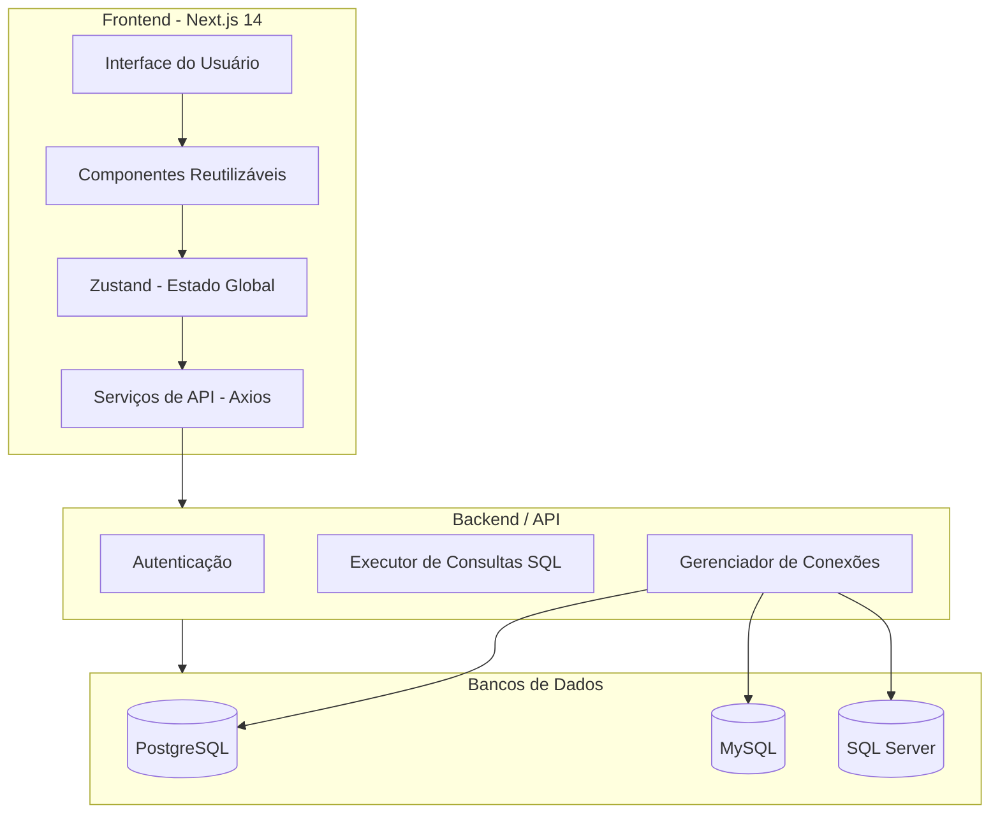

Beleza 👍
Então vou te entregar um **`README.md` final** que junta:

* A descrição inicial do projeto
* A estrutura e explicações que você passou (🧱, 🖼️, 🧠, 🧪, 🔮, 📌)
* A parte visual que eu já tinha criado (prints, diagrama, comandos)
* E correção do erro do Mermaid no GitHub

Aqui está o README completo:

---

```markdown
# 📊 Gestor de Base de Dados - Frontend


O **Gestor de Base de Dados** é um sistema web moderno para **gerenciamento, consulta e visualização de bancos de dados** de forma intuitiva.  
Este repositório contém o **Frontend**, desenvolvido com **Next.js 14**, **TypeScript** e **Tailwind CSS**.

---

## 🧱 1. Estrutura Geral do Projeto (Arquitetura de Pastas)


/src
│
├── app/                     → Rotas (Next.js 13+)
│   ├── dashboard/           → Página principal (home do usuário logado)
│   ├── consultas/           → Módulo de consultas simplificadas
│   ├── tabelas/             → Listagem e detalhes de tabelas
│   ├── sql/                 → Editor de SQL avançado
│   ├── historico/           → Histórico de consultas
│   ├── conexoes/            → Gerenciador de conexões
│   ├── login/               → Página de autenticação
│   ├── settings/            → Configurações gerais
│   └── layout.tsx           → Layout base para navegação
│
├── components/              → Componentes reutilizáveis
│   ├── TableViewer.tsx
│   ├── SQLConsole.tsx
│   ├── Sidebar.tsx
│   ├── Header.tsx
│   └── Modal.tsx
│
├── lib/                     → Funções utilitárias
│   ├── api.ts
│   ├── databaseHelpers.ts
│
├── services/                → Comunicação com backend
│   ├── queryService.ts
│   ├── tableService.ts
│   └── authService.ts
│
├── hooks/                   → Hooks customizados
│   └── useAuth.ts
│
├── store/                   → Zustand ou Redux para estado global
├── styles/                  → Estilização global
├── types/                   → Tipagens TypeScript
└── middleware.ts            → Proteção de rotas


## 🖼️ 2. Navegação Principal (Layout)

**Sidebar fixa** com:
- Dashboard  
- Consultas  
- Tabelas  
- SQL  
- Conexões  
- Histórico  
- Configurações  

**Header** com:
- Nome do usuário  
- Tema claro/escuro  
- Botão de logout  

---

## 🧠 3. Páginas-Chave e Componentes

### 🔍 Consultas Simplificadas
- Componente: `SimpleQueryForm`
- Entrada: nome da tabela
- Resultado: tabela paginada com filtros

### 📂 Tabelas e Validações
- Componente: `TableDetailViewer`
- Visualiza tipos de dados, PK/FK e faz validações

### 🧹 Análise de Duplicados
- Componente: `DuplicateAnalyzer`
- Mostra registros repetidos e gera insights

### 🧰 SQL Avançado
- Componente: `SQLConsole` com highlight e execução em tempo real

### 📌 Conexões
- Componente: `ConnectionManager`
- Cria, edita e valida conexões

### 🕘 Histórico
- Componente: `QueryHistory`
- Filtra por data, tipo e usuário

---

## 🧪 4. Tecnologias e Pacotes Sugeridos

- **UI**: Tailwind CSS + shadcn/ui ou NextUI  
- **Editor SQL**: [Monaco Editor](https://github.com/microsoft/monaco-editor)  
- **Estado global**: Zustand  
- **Formulários**: React Hook Form + Zod  
- **Autenticação**: NextAuth.js ou JWT manual  
- **Realtime (futuro)**: Socket.IO  
- **Gráficos**: Recharts ou Chart.js  


## 🔮 5. Funcionalidades Futuras

- 📊 **Dashboard** com métricas  
- 🧭 **Editor visual de relacionamentos** com React Flow  
- 🔐 **Logs e auditoria**  
- 🤝 **Colaboração em tempo real**  


## 📌 Exemplo de Rota: `Consultas`

```tsx
// src/app/consultas/page.tsx
import { SimpleQueryForm } from "@/components/SimpleQueryForm";
import { QueryResults } from "@/components/QueryResults";

export default function ConsultasPage() {
  return (
    <div className="p-6">
      <h1 className="text-2xl font-bold mb-4">Consultas Simplificadas</h1>
      <SimpleQueryForm />
      <QueryResults />
    </div>
  );
}
````

---

## 🖼️ Capturas de Tela

> Substitua por imagens reais depois

| Página       | Captura                            |
| ------------ | ---------------------------------- |
| Dashboard    |  |
| Consultas    |  |
| SQL Avançado |       |
| Conexões     |    |

---

## 🛠️ Arquitetura Simplificada



---

## 🛠️ Como Executar o Projeto

```bash
# 1. Clonar o repositório
git clone https://github.com/seu-usuario/gestor-bd-frontend.git

# 2. Entrar no diretório
cd gestor-bd-frontend

# 3. Instalar dependências
npm install

# 4. Rodar em ambiente de desenvolvimento
npm run dev

# 5. Compilar para produção
npm run build

# 6. Iniciar aplicação em produção
npm start
```

---

## 📌 Contribuindo

1. Faça um fork do projeto
2. Crie uma branch (`git checkout -b minha-feature`)
3. Commit suas alterações (`git commit -m 'Minha nova feature'`)
4. Push para o repositório (`git push origin minha-feature`)
5. Abra um Pull Request

---

## 📄 Licença

Este projeto está licenciado sob a **MIT License**.
